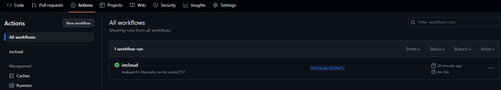

# InCloud GitHub云上扫描器

## 简介
本项目gork于https://github.com/inbug-team/InCloud这位大佬，但是由于项目是2021年的，作者也没有进行更新，如果使用需要自己进行修改部分代码。

这里我已经将代码修改为最新版并进行测试，可以成功运行，截图如下。（为了安全，这里代码我没有更新。）

### 工具定位
运行于GitHub Actions 的仓库中自动化、自定义和执行软件开发工作流程，可以自己根据喜好定制功能，InCloud已经为您定制好了十种针对网段和域名的不同场景的信息收集与漏洞扫描流程。
* [PortScan-AllPort](https://github.com/inbug-team/InCloud/tree/PortScan-AllPort) 对单IP文件列表进行全端口扫描，输出可用Web服务标题。
* [PortScan-AllPort-Xray-Dirscan](https://github.com/inbug-team/InCloud/tree/PortScan-AllPort-Xray-dirscan)   对单IP文件列表进行全端口扫描，输出可用Web服务标题，对Web服务进行Xray爬虫爬取与漏洞扫描，对Web服务进行Ffuf目录递归扫描。。
* [PortScan-Top1000](https://github.com/inbug-team/InCloud/tree/PortScan-Top1000) 对单C段IP列表进行Top1000端口扫描，输出可用Web服务标题。
* [PortScan-Top1000-Xray](https://github.com/inbug-team/InCloud/tree/PortScan-Top1000-Xray) 对单C段IP列表进行Top1000端口扫描，输出可用Web服务标题，对Web服务进行Xray爬虫爬取与漏洞扫描。
* [PortScan-Top1000-Dirscan](https://github.com/inbug-team/InCloud/tree/PortScan-Top1000-Dirscan) 对单C段IP列表进行Top1000端口扫描，输出可用Web服务标题，，对Web服务进行Ffuf目录递归扫描。
* [PortScan-Top1000-Dirscan-Webcrack](https://github.com/inbug-team/InCloud/tree/PortScan-Top1000-Dirscan-Webcrack) 对单C段IP列表进行Top1000端口扫描，输出可用Web服务标题，，对Web服务进行Ffuf目录递归扫描，对ffuf的扫描结果使用Webcrack进行后台弱口令爆破。
* [SubDomain-Portscan-Vulnscan](https://github.com/inbug-team/InCloud/tree/SubDomain-Portscan-Vulnscan) 对域名进行子域名枚举与接口查询，对查询的子域名进行Top1000端口扫描，输出可用Web服务标题，对Web服务进行Nuclei漏洞扫描。
* [SubDomain-Portscan-Xray](https://github.com/inbug-team/InCloud/tree/SubDomain-Portscan-Xray) 对域名进行子域名枚举与接口查询，对查询的子域名进行Top1000端口扫描，输出可用Web服务标题，对Web服务进行Xray爬虫爬取与漏洞扫描。
* [SubDomain-Portscan-Dirscan](https://github.com/inbug-team/InCloud/tree/SubDomain-Portscan-Dirscan) 对域名进行子域名枚举与接口查询，对查询的子域名进行Top1000端口扫描，输出可用Web服务标题，，对Web服务进行Ffuf目录递归扫描。
* [SubDomain-Portscan-Dirscan-Webcrack](https://github.com/inbug-team/InCloud/tree/SubDomain-Portscan-Dirscan-Webcrack) 对域名进行子域名枚举与接口查询，对查询的子域名进行Top1000端口扫描，输出可用Web服务标题，，对Web服务进行ffuf目录递归扫描，对ffuf的扫描结果使用Webcrack进行后台弱口令爆破。
